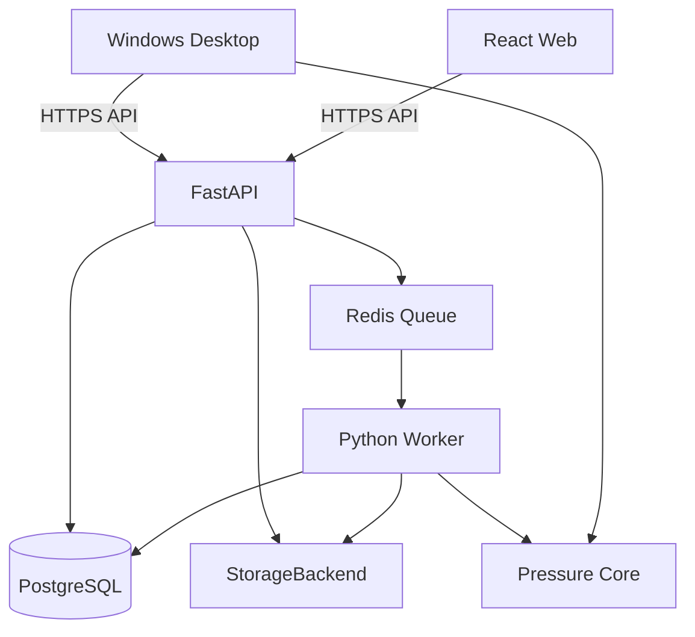

# ARDOR Pressure Test — техническая архитектура

**Статус:** Approved 1.0  
**Дата:** 2026-08-19  
**Подход:** local-first modular monolith, server-ready  
**Базовый commit аудита:** `e70253de4bdf0fcb28bab6f54bb6a5a3357b7124`

## 1. Решение в одном абзаце

Система развивается как модульный монолит: существующее Python-ядро обработки отделяется от Tkinter; локальный Windows-клиент и FastAPI используют одну доменную библиотеку; React/TypeScript предоставляет веб-интерфейс; PostgreSQL хранит метаданные, доступы, ревизии и поисковый индекс; файлы хранятся через абстракцию StorageBackend; длительная обработка выполняется worker-процессом. Весь контур сначала поднимается локально через Docker Compose и только затем переносится на Ubuntu с production override.

## 2. Почему не микросервисы

Для текущей команды микросервисы добавят сетевые контракты, observability, deployment и отказоустойчивость до появления реальной потребности. Границы модулей закладываются внутри одного репозитория и нескольких runtime-процессов. Выделение отдельного сервиса позднее возможно без изменения бизнес-модели.

## 3. Факты текущего аудита

### Сильные стороны

- Python >=3.11;
- разделены CSV reader, column detector, cleaner, analyzer, graph, Excel, TXT и PDF;
- есть dataclasses моделей;
- есть unit/smoke tests;
- исходный CSV не изменяется;
- новая версия уже создаёт папку по Log No.

### Блокирующие ограничения

- GUI управляет конфигурацией, путями и orchestration;
- повторные обработки смешиваются в одной папке;
- нет атомарной ревизии и manifest;
- исходный CSV лежит отдельно от папки лога;
- ProcessingResult не содержит PDF/photo paths и полного описания комплекта;
- нет bundle, operator, photo category и lifecycle status;
- нет auth, API, database, audit и sync queue;
- `Log_021FED` порождает `Log_Log_021FED`;
- повторные фотографии копируются под новыми именами;
- README и installer описывают старую структуру;
- `fpdf` используется, но отсутствует в заявленных project dependencies;
- бинарные релизы хранятся в Git вместо Releases.

## 4. Целевая схема



Локально HTTPS может быть заменён на HTTP внутри localhost-контура. Контракт и authentication flow остаются такими же, как для будущего сервера.

## 5. Языки и технологии

| Область | Решение | Причина |
|---|---|---|
| Pressure core | Python >=3.11 | Существующий проверенный код |
| Desktop | Tkinter/Ttk на первом этапе | Сохранение рабочей программы |
| API | FastAPI + Pydantic | Типизированный Python API и OpenAPI |
| ORM | SQLAlchemy 2.x | Явная зрелая модель данных |
| Миграции | Alembic | Версионирование схемы PostgreSQL |
| Web | React + TypeScript strict | Компонентный быстрый интерфейс |
| Build web | Vite | Лёгкая локальная разработка |
| Database | PostgreSQL | Транзакции, индексы, full-text/JSONB |
| Jobs | Celery + Redis | Отделение тяжёлой обработки от HTTP |
| File storage | Local filesystem adapter | Простой local-first старт |
| PDF current | fpdf2 | Уже используется приложением |
| XLSX | openpyxl | Уже используется приложением |
| Graph | Matplotlib | Уже используется приложением |
| Containers | Docker Compose | Одинаковый локальный и серверный контур |
| Tests Python | pytest | Текущая база тестов |
| Tests web | Vitest + Testing Library | Компонентные тесты |
| E2E | Playwright | Полный пользовательский сценарий |
| Windows build | PyInstaller + Inno Setup | Сохранение текущего пути релиза |

Версии не задаются широкими диапазонами в production. После первого compatibility checkpoint зависимости фиксируются lockfiles/constraints. Обновление версии — отдельная задача с тестами.

Официальные основания выбора: FastAPI поддерживает типизированные API и отдельно рекомендует внешнюю очередь для тяжёлых вычислений; React документирует работу с TypeScript; Vite поддерживает TypeScript/JSX; PostgreSQL предоставляет full-text search и GIN/JSONB; Docker Compose описывает весь multi-container stack одним YAML; SQLAlchemy 2.x остаётся текущей стабильной серией, Alembic предназначен для её миграций, Celery — отдельная task queue.

## 6. Предлагаемая структура репозитория

Переход выполняется постепенно, без одномоментного перемещения всех файлов.

```text
ardor-pressure-test/
├── apps/
│   ├── desktop/                 # Tkinter composition/UI
│   └── web/                     # React + TypeScript
├── services/
│   ├── api/                     # FastAPI routes/application layer
│   └── worker/                  # Celery tasks
├── packages/
│   └── pressure_core/           # CSV, cleaning, analysis, reports
├── migrations/                  # Alembic
├── infra/
│   ├── compose.yaml
│   ├── compose.dev.yaml
│   └── compose.production.yaml
├── docs/
│   ├── PRODUCT_REQUIREMENTS.md
│   ├── TECHNICAL_ARCHITECTURE.md
│   ├── ROADMAP.md
│   └── adr/
├── tests/
│   ├── unit/
│   ├── integration/
│   ├── contract/
│   └── e2e/
└── AGENTS.md
```

Сначала `src/wika_report` сохраняется. Новые boundaries вводятся адаптерами и тестами; физическое переименование выполняется отдельным этапом.

## 7. Доменные модули

1. **Identity & Access** — users, roles, permissions, sessions, password reset.
2. **Projects & Visibility** — открытый доступ по умолчанию и deny/restriction rules.
3. **Pressure Tests** — Log, Revision, metadata, PASS/FAIL proposal.
4. **Artifacts** — manifest, checksums, categories, downloads.
5. **Processing** — CSV pipeline и report generation jobs.
6. **Synchronization** — desktop devices, queue receipts, idempotency.
7. **Pressure Test Records** — официальный документ прораба.
8. **Confirmation** — approval and confirmed PDFs.
9. **Audit** — append-only events.
10. **Notifications** — in-app events; email adapter позднее.
11. **Search** — exact identifiers and ranked text search.
12. **Settings** — portable user settings vs device settings.

## 8. Основная модель данных

### Identity

- `users`
- `roles`
- `permissions`
- `user_permissions`
- `sessions`
- `password_reset_tokens`
- `devices`
- `user_settings`
- `device_settings`

Должность хранится отдельно от permissions. Это позволяет работнику иметь полный доступ, а конкретному прорабу — не иметь права подтверждения.

### Work organization

- `projects`
- `project_memberships`
- `visibility_restrictions`
- `customers`
- `vessels`
- `jobs`
- `sales_orders`

Project остаётся необязательной сущностью до уточнения бизнеса.

### Pressure tests

- `pressure_tests`: стабильная идентичность и уникальный normalized Log No.
- `test_revisions`: immutable snapshot, revision number, primary flag, status.
- `pipes`
- `bundles`
- `revision_pipes`
- `revision_bundles`
- `test_decisions`: automatic proposal, human decision, reason.

### Artifacts

- `artifacts`: type, filename, media type, size, SHA-256, storage key.
- `revision_artifacts`
- `photo_metadata`: category `pipe|gauge|installation|other`.
- `manifests`: schema version and generator versions.

### Pressure Test Records

- `pressure_test_records`
- `pressure_test_record_revisions`
- `pressure_test_record_rows`
- `record_row_log_links`
- `record_confirmations`
- `record_signed_artifacts`

### Operations

- `processing_jobs`
- `sync_operations`
- `sync_receipts`
- `audit_events`
- `notifications`

## 9. Идентификаторы и нормализация

- Внутренние ID: UUID.
- Внешний ключ лога: normalized `Log No.` с case-insensitive unique index.
- Отображаемое значение хранится отдельно при необходимости.
- Prefix `Log_` является presentation concern и не входит в canonical Log No.
- Filename никогда не используется как primary key.
- Все timestamps хранятся в UTC и отображаются в timezone пользователя.
- Производственные номера хранятся как строки, не числа.

## 10. Каноническая ревизия

```text
storage/logs/{log_uuid}/revisions/{revision_uuid}/
├── manifest.json
├── source/
│   └── source.csv
├── generated/
│   ├── graph.png
│   ├── report.xlsx
│   ├── report.txt
│   └── report.pdf
├── photos/
│   ├── pipe/
│   ├── gauge/
│   ├── installation/
│   └── other/
└── additional/
```

Пользователь может скачать friendly ZIP с понятными именами. Физические storage keys используют UUID и не зависят от переименования.

### Manifest minimum

- schema version;
- client version;
- processing core version;
- Log No.;
- revision local UUID;
- created by/device/time;
- metadata snapshot;
- полный список файлов;
- role/category каждого файла;
- size and SHA-256;
- parent revision, если есть.

## 11. Атомарная синхронизация

### Протокол

1. `POST /api/v1/sync/sessions` с manifest summary и idempotency key.
2. Сервер отвечает, новый ли это лог, новая ревизия или уже принятая операция.
3. Клиент загружает только отсутствующие файлы.
4. Каждый файл проверяется по размеру и SHA-256.
5. `POST /api/v1/sync/sessions/{id}/complete`.
6. Сервер в транзакции создаёт revision links и receipt.
7. До шага 6 ревизия не видна как Complete.

### Offline queue

Локальная очередь хранится в SQLite, а не в `config.json`. Она содержит local operation UUID, manifest path, status, attempts, last error и server receipt. Файлы очереди нельзя удалять до подтверждения сервера.

### Конфликт

Конфликт создаёт отдельную ревизию. Primary revision назначается отдельной optimistic-lock операцией. Перезапись существующей ревизии запрещена.

## 12. Обработка CSV

Текущий pipeline сохраняется:

`read → detect → clean → normalize → analyze → render artifacts`.

Изменения:

- функции получают DTO/paths, но не читают GUI state;
- orchestration возвращает полный `RevisionBuildResult`;
- генерация идёт во временном каталоге;
- после успешного создания всех обязательных файлов каталог атомарно фиксируется;
- ошибки не перемещают исходный пользовательский CSV без явной политики;
- output validation проверяет наличие и SHA-256;
- core одинаков для Desktop и Worker.

## 13. PASS/FAIL engine

Движок выдаёт `proposal`, а не окончательный юридический результат.

Вход:

- required pressure;
- evaluation window strategy;
- cleaned pressure series;
- quality warnings;
- criteria version.

Выход:

- proposed result;
- evaluated interval;
- minimum/maximum;
- violations;
- criteria version;
- quality flags.

Критерий первой версии оформляется как versioned strategy `last_full_hour_v1`, чтобы позднее заменить правило без изменения старых ревизий.

## 14. Pressure Test Record generator

Первая версия использует фиксированную ARDOR layout definition и отдельную domain model. PDF не собирается из случайных строк GUI.

Процесс:

1. Создать Draft.
2. Выбрать логи через API search.
3. Добавить rows и подтянуть значения.
4. Дополнить Job, Sales Order, Project, Customer, Vessel, Inspection и drawing data.
5. Провести validation.
6. Сформировать preview PDF.
7. Выпустить record revision.
8. При необходимости подтвердить и создать confirmed PDF.
9. При необходимости загрузить scanned signed PDF как отдельный artifact.

Layout покрывается golden/visual PDF тестами. Данные не зависят от координат конкретного шаблона, поэтому позднее можно добавить TemplateAdapter.

## 15. Поиск

Для 1–10 тысяч логов отдельный Elasticsearch не требуется.

- B-tree indexes для exact identifiers/date/pressure.
- `pg_trgm` для tolerable partial identifier search.
- PostgreSQL full-text search для notes/project/customer.
- GIN indexes при необходимости.
- rank exact Log/Pipe/Bundle выше текста.

Поиск по TXT-файлам используется только при импорте legacy-архива. После импорта запросы идут в PostgreSQL.

## 16. Authentication и security

- username/email + password;
- Argon2id password hashing;
- browser session в Secure, HttpOnly, SameSite cookie;
- CSRF protection для cookie-auth mutations;
- desktop использует device-bound refresh token в Windows credential storage;
- short-lived access token;
- rate limiting login/reset;
- forced password change для временного пароля;
- secrets только в environment/secret files;
- authorization проверяется на API, не только в UI;
- audit для login, download, edit, delete, confirm и permission changes.

## 17. Local Docker topology

Первая инфраструктурная версия:

```text
web
api
worker
postgres
redis
```

Файлы монтируются в named volume. Desktop работает на Windows host и обращается к `localhost` API. Для разработки возможен запуск Python/Node на host, но интеграционная проверка всегда выполняется через Compose.

## 18. Production topology позднее

- reverse proxy с HTTPS;
- отдельные контейнеры с уникальными names/networks;
- отдельная БД/роль PostgreSQL;
- отдельные volumes;
- health checks;
- backup database + artifacts;
- restore drill;
- resource limits;
- staging перед production.

Существующие проекты Ubuntu не изменяются до отдельного deployment plan.

## 19. Observability

- structured JSON logs;
- correlation ID;
- job/sync IDs;
- health/readiness endpoints;
- processing duration and failure metrics;
- audit events отдельно от operational logs;
- очистка/rotation технических логов;
- отсутствие секретов и полного содержимого документов в логах.

## 20. Testing pyramid

### Unit

- parsing and normalization;
- Log No. normalization;
- pipe/bundle parsing;
- PASS/FAIL strategies;
- revision state machine;
- permission rules;
- manifest and hashes.

### Integration

- PostgreSQL repositories;
- Alembic upgrade from clean database;
- storage adapter;
- worker job;
- API auth and sync idempotency.

### Contract

- Desktop ↔ API version compatibility;
- OpenAPI snapshot;
- manifest schema fixtures.

### E2E

- login;
- process CSV;
- attach mandatory photos;
- create Complete revision;
- offline queue → sync;
- search by Log/Pipe/Bundle;
- download ZIP;
- create ARDOR Pressure Test Record;
- confirm revision;
- restore logically deleted data.

### Golden files

- PNG graph;
- TXT structure;
- XLSX sheets/values;
- PDF page count and rendered comparison;
- ARDOR form visual comparison.

## 21. Миграция legacy-архива

Импорт проходит в два этапа:

1. Dry run inventory: folders, TXT parsing, duplicate hashes, missing CSV, duplicate Log No., naming anomalies.
2. Approved import: canonical log/revision creation with immutable legacy manifest.

Старая структура не удаляется. Импорт формирует отчёт об ошибках и требует ручного решения неоднозначностей.

## 22. Release и обновления Desktop

- semantic versioning;
- GitHub Releases вместо binaries in Git;
- release manifest с version, URL, SHA-256 и compatibility range;
- уведомление в приложении;
- установка после подтверждения пользователя;
- очередь и настройки сохраняются;
- rollback/previous installer доступен;
- code signing — рекомендуемый production requirement.

## 23. ADR, которые потребуются

- ADR-001 modular monolith;
- ADR-002 canonical immutable revision;
- ADR-003 PostgreSQL + filesystem storage;
- ADR-004 sync protocol and idempotency;
- ADR-005 auth/session model;
- ADR-006 PASS/FAIL criteria versioning;
- ADR-007 Pressure Test Record template architecture;
- ADR-008 legacy import policy;
- ADR-009 Desktop update trust model.

## 24. Официальные технические источники

- FastAPI: https://fastapi.tiangolo.com/
- FastAPI background tasks caveat: https://fastapi.tiangolo.com/tutorial/background-tasks/
- React + TypeScript: https://react.dev/learn/typescript
- Vite guide: https://vite.dev/guide/
- PostgreSQL full-text search: https://www.postgresql.org/docs/current/textsearch-controls.html
- PostgreSQL JSONB/GIN: https://www.postgresql.org/docs/current/datatype-json.html
- SQLAlchemy 2.x: https://docs.sqlalchemy.org/en/20/
- Alembic: https://alembic.sqlalchemy.org/
- Docker Compose: https://docs.docker.com/compose/
- Celery: https://docs.celeryq.dev/
